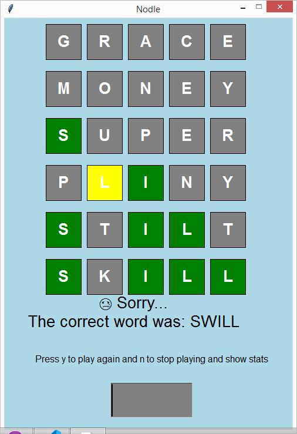

# nodle
 A clone of the game Wordle where the user have to guess a five letter word in six attempts or less.

 It was made to practice coding bigger projects with focus on functionality

 

 It was made with Python using a basic graphics library and an API to fetch the generated words.
